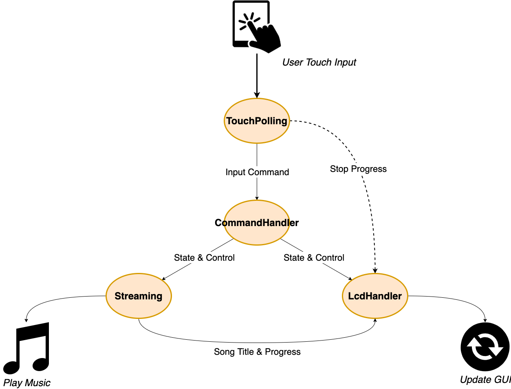
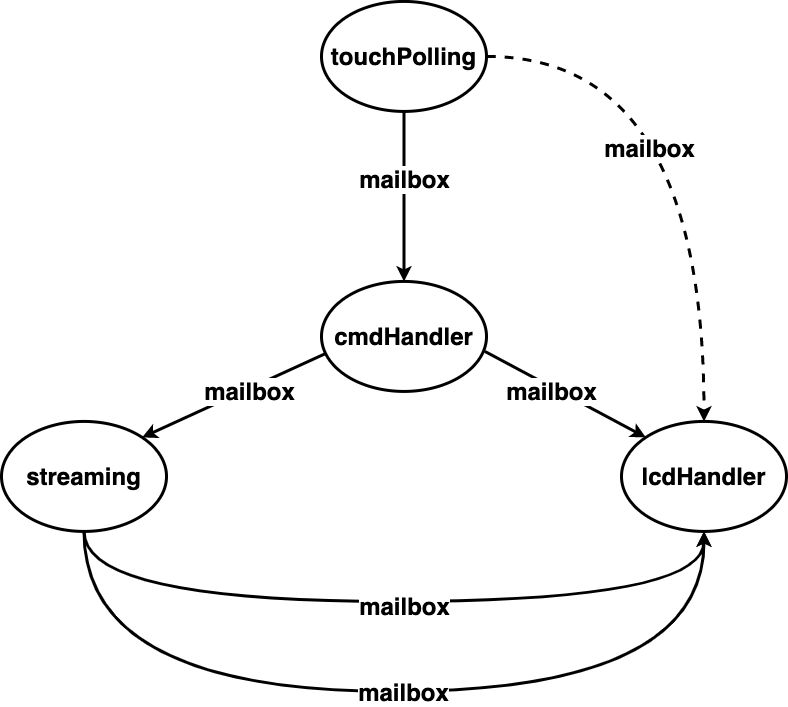
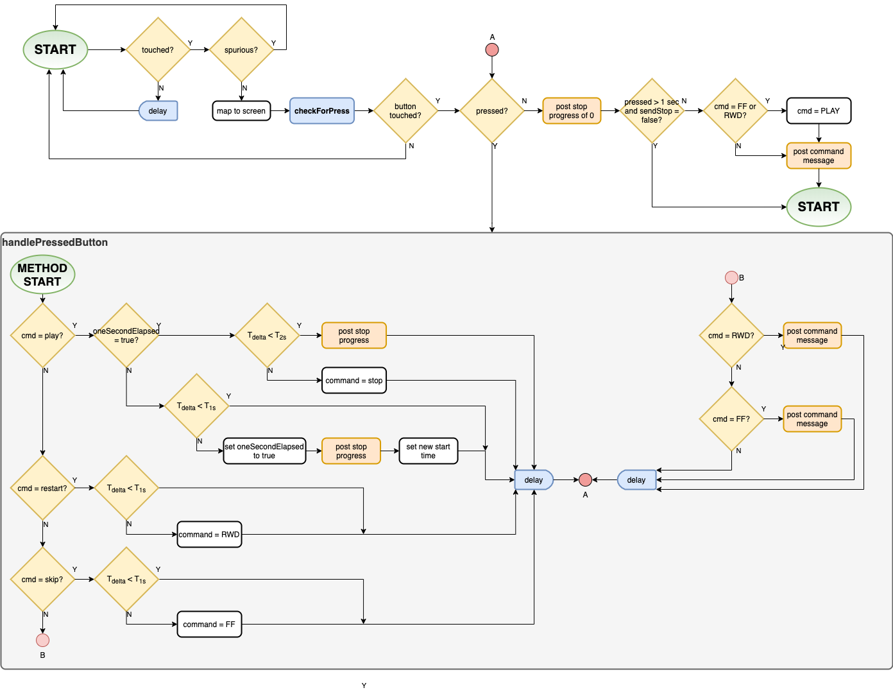
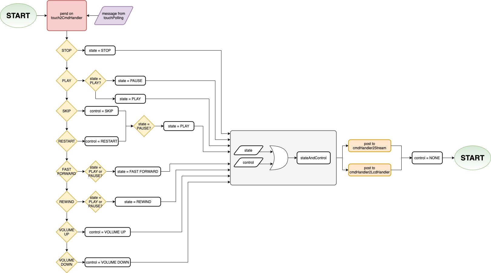
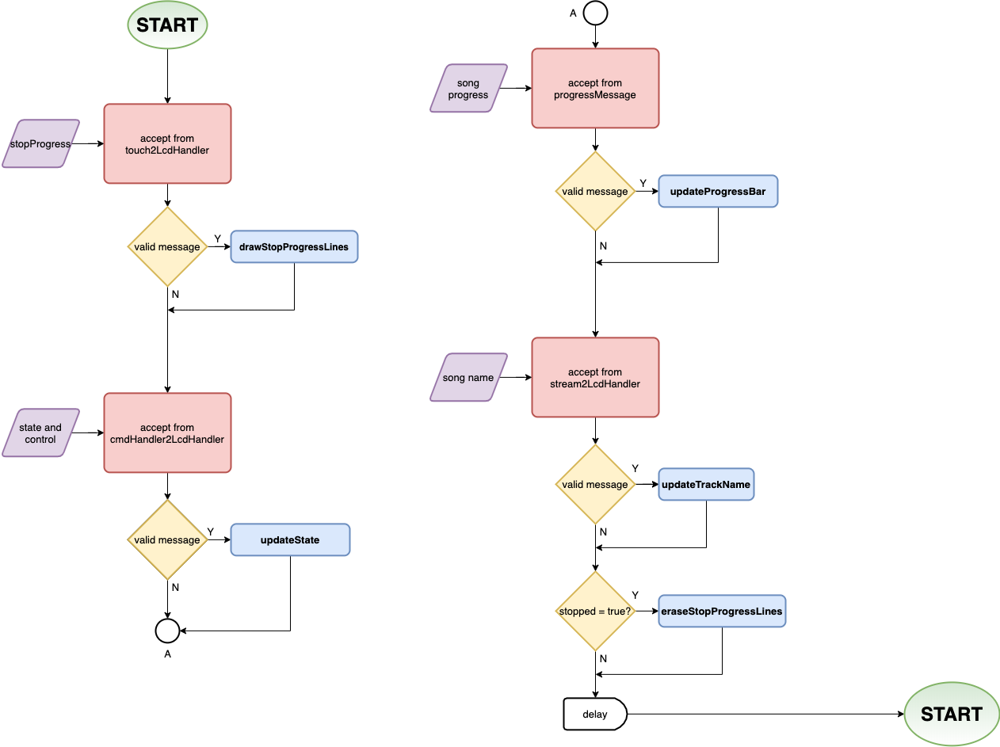
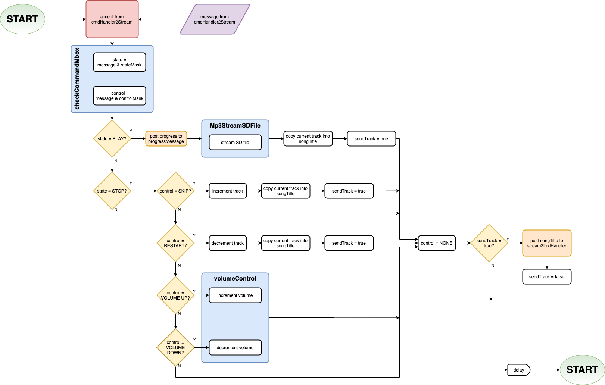

# MP3 Player Project - Victor Baldwin

### Operation

1. [Generating the song list](generate_song_list.md)
2. Controls
        

### Tasks
[Task Overview](task_overview.md)

### Diagrams
[High Level RelationShip](HighLevelRelationShip.pdf)

[Task Communication](taskCommunication.pdf)

[InitializationTask](Initialization.pdf)

[TouchPollingTask](touchPolling.pdf)

[CommandHandlerTask](commandHandler.pdf)

[LcdHandlerTask](lcdHandler.pdf)

 - [Draw/Delete Stop Progress Lines](stopProgressLines.pdf)
 - [Update Progress Bar](updateProgressBar.pdf)
 - [Update State](updateState.pdf)
 - [Volume Control](volumeControl.pdf)

[StreamingTask](streaming.pdf)

 - [MP3StreamSDFile](Mp3StreamSDFile.pdf)